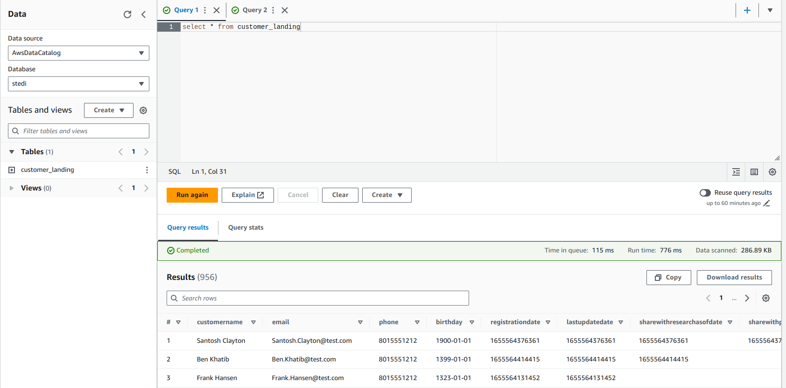
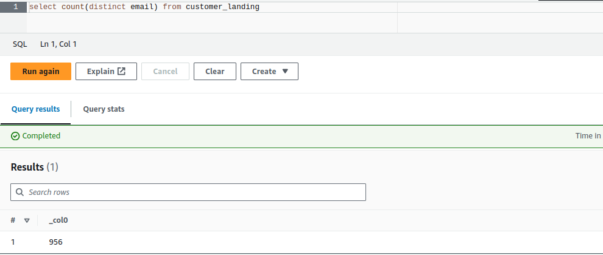
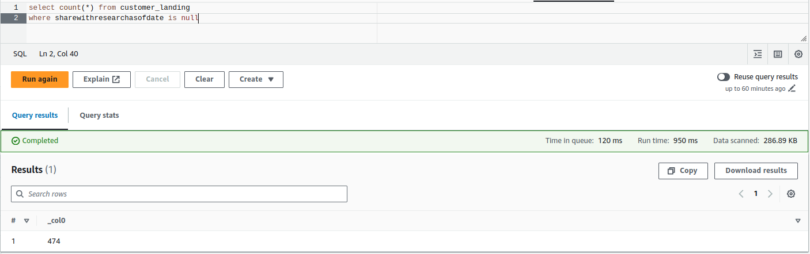
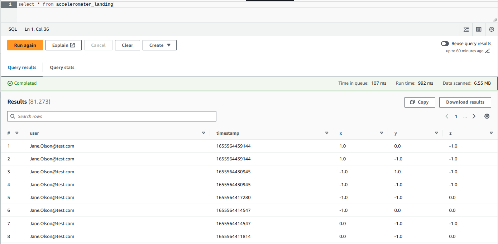
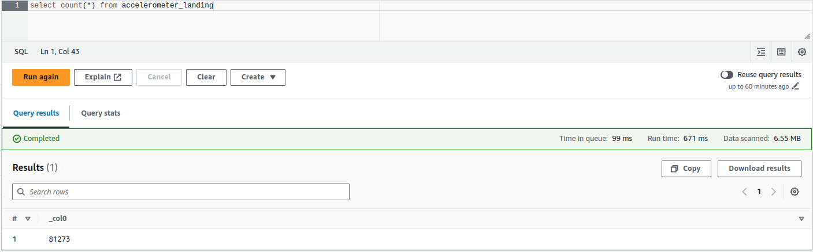
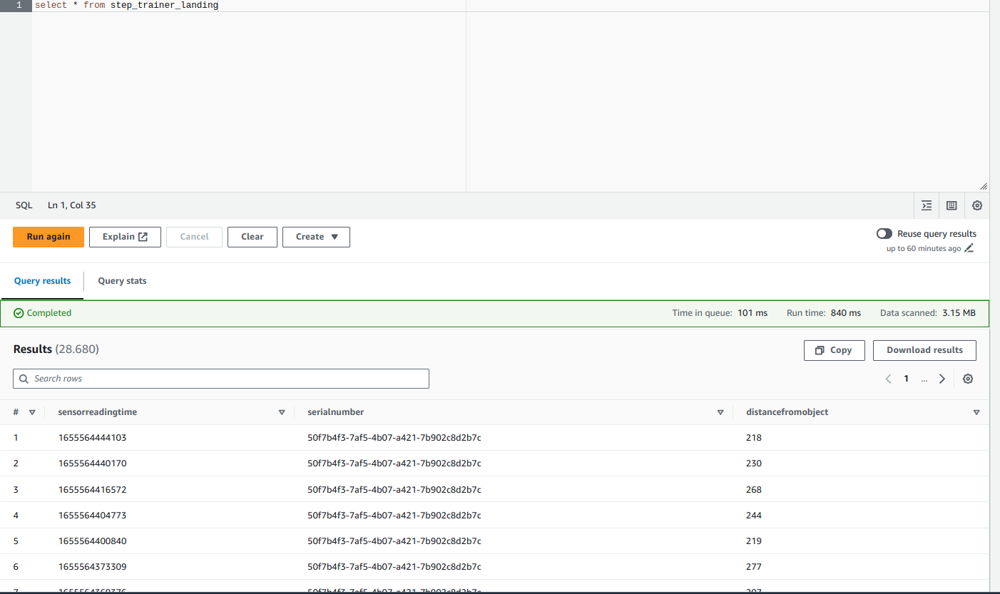
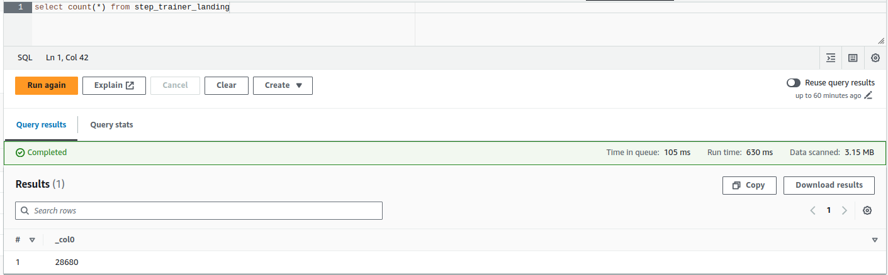
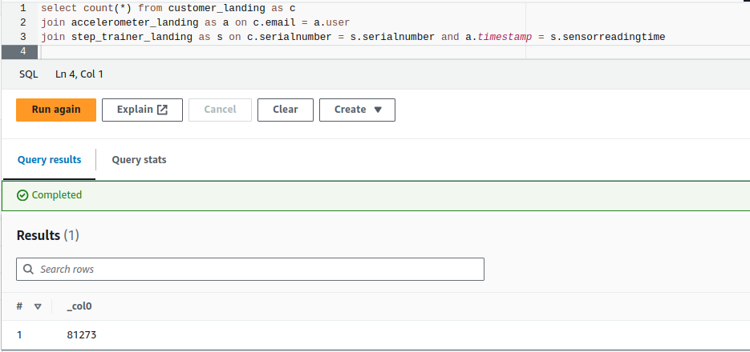

# 3-1-Project-Spark-Data-Lakes

1. [Project Details](#schema1)
2. [Project Summary](#schema2)
3. [Project Environment](#schema3)
4. [Datasets](#schema4)
5. [Landing Zone](#schema5)

<hr>
<a name='schema1'></a>

## 1. Project Details

The STEDI Team has been hard at work developing a hardware STEDI Step Trainer that:

- trains the user to do a STEDI balance exercise;
- and has sensors on the device that collect data to train a machine-learning algorithm to detect steps;
- has a companion mobile app that collects customer data and interacts with the device sensors. 

STEDI has heard from millions of early adopters who are willing to purchase the STEDI Step Trainers and use them.

Several customers have already received their Step Trainers, installed the mobile application, and begun using them 
together to test their balance. The Step Trainer is just a motion sensor that records the distance of the object 
detected. The app uses a mobile phone accelerometer to detect motion in the X, Y, and Z directions.

The STEDI team wants to use the motion sensor data to train a machine learning model to detect steps accurately in 
real-time. Privacy will be a primary consideration in deciding what data can be used.

Some of the early adopters have agreed to share their data for research purposes. Only these customers’ Step Trainer 
and accelerometer data should be used in the training data for the machine learning model.

<hr>
<a name='schema2'></a>

## 2. Project Summary


As a data engineer on the STEDI Step Trainer team, my responsibility involves extracting data from the STEDI Step 
Trainer sensors and the mobile application.
I have to select and organize this data in a data lakehouse solution in AWS, so that data scientists can use it to 
train the learning model

<hr>
<a name='schema3'></a>

## 3. Project Environment


**AWS Environment**

You'll use the data from the STEDI Step Trainer and mobile app to develop a lakehouse solution in the cloud that 
curates the data for the machine learning model using:

- Python and Spark
- AWS Glue
- AWS Athena
- AWS S3

**Github Environment**

You'll also need a github repository to store your SQL scripts and Python code in. You'll submit the code in this 
github repo for the project submission.

<hr>
<a name='schema4'></a>

## 4. Datasets

STEDI has three JSON data sources to use from the Step Trainer. 

- customer
  - This is the data from fulfillment and the STEDI website.
  - contains the following fields:
      - serialnumber
      - sharewithpublicasofdate
      - birthday
      - registrationdate
      - sharewithresearchasofdate
      - customername
      - email
      - lastupdatedate
      - phone
      - sharewithfriendsasofdate
- step_trainer
  - This is the data from the motion sensor.
  - contains the following fields:
    - sensorReadingTime
    - serialNumber
    - distanceFromObject
- accelerometer
  - This is the data from the mobile app.
  - contains the following fields:
    - timeStamp
    - user
    - x
    - y
    - z

<hr>
<a name='schema5'></a>

## 5. Landing Zone

## **Customer**


- Count of customer_landing

```
select count(distinct email) from customer_landing
```


- The customer_landing data contains rows with a blank `sharewithresearchasofdate`
```
select count(*) from customer_landing 
where sharewithresearchasofdate is null
```



## **Accelerometer**

- Count of accelerometer



## **Step Trainer**

- Count of step trainer



## **JOIN**

